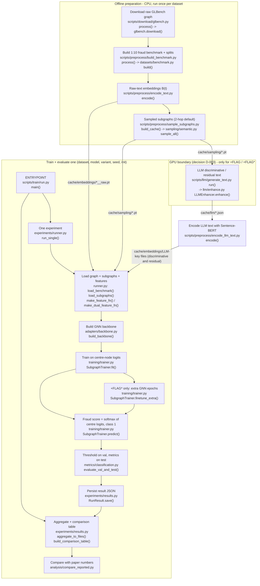
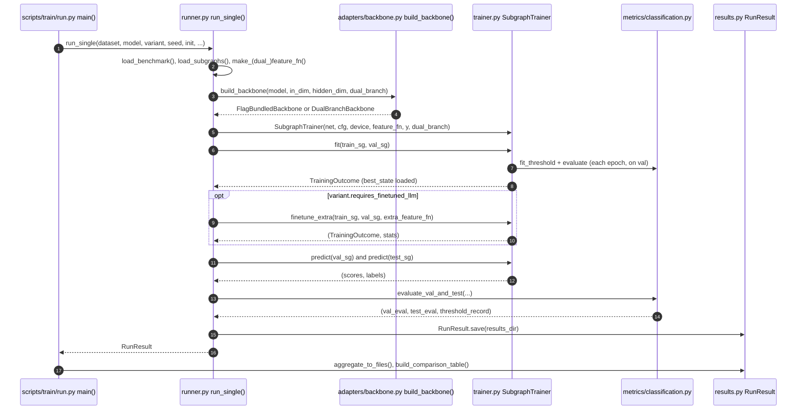
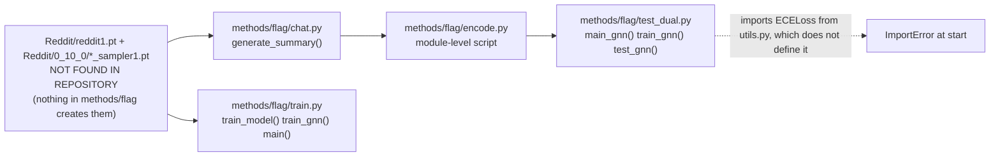

# 00 - Master workflow

[README](README.md) | next: [01 Repository map](01-repository-map.md) | [02 Pipeline](02-flag-pipeline.md) | [06 Call graph](06-function-call-graph.md) | [07 Data flow](07-data-flow.md)

Scope: the **MAIN PATH** = the `flagbench` reproduction. Upstream `methods/flag/`
is shown only where the reproduction imports it.

## 1. Master diagram (verified against the code)

Stages are named exactly as the code has them. Note the actual order: text
embedding and **similarity-based sampling come before the GNN**, and there is an
LLM text-generation stage (GPU-only) that the generic
"input -> preprocessing -> ... -> detection" outline does not show.



> The P4 -> T2 edge stands for the two cache files located by
> `runner._llm_embeddings_path()` (one whose key contains `discriminative`, one
> `residual`; `residual` is only read for `flag_finetuned`).

Navigation table (always works, unlike Mermaid `click`):

| Node | Source | Detail doc |
|---|---|---|
| P0 download | [scripts/download/glbench.py](../../scripts/download/glbench.py), [glbench.py](../../src/flagbench/datasets/glbench.py) | [02](02-flag-pipeline.md) |
| P1 benchmark | [build_benchmark.py](../../scripts/preprocess/build_benchmark.py), [datasets/benchmark.py](../../src/flagbench/datasets/benchmark.py) | [02](02-flag-pipeline.md), [07](07-data-flow.md) |
| P2 text embeddings | [encode_text.py](../../scripts/preprocess/encode_text.py) | [04](04-representation-and-similarity.md) |
| P3 subgraphs | [sample_subgraphs.py](../../scripts/preprocess/sample_subgraphs.py), [semantic.py](../../src/flagbench/sampling/semantic.py) | [03](03-subgraph-generation.md) |
| G1 LLM text | [generate_text.py](../../scripts/llm/generate_text.py), [enhance.py](../../src/flagbench/llm/enhance.py) | [02](02-flag-pipeline.md), [04](04-representation-and-similarity.md) |
| P4 encode LLM text | [encode_llm_text.py](../../scripts/preprocess/encode_llm_text.py) | [04](04-representation-and-similarity.md) |
| T0 entrypoint | [scripts/train/run.py](../../scripts/train/run.py) | [06](06-function-call-graph.md) |
| T1-T3, T6 | [runner.py](../../src/flagbench/experiments/runner.py) | [05](05-feature-and-detection-pipeline.md) |
| T3 backbone | [adapters/backbone.py](../../src/flagbench/adapters/backbone.py) | [05](05-feature-and-detection-pipeline.md) |
| T4-T6 trainer | [training/trainer.py](../../src/flagbench/training/trainer.py) | [05](05-feature-and-detection-pipeline.md) |
| T7 metrics | [metrics/classification.py](../../src/flagbench/metrics/classification.py) | [05](05-feature-and-detection-pipeline.md) |
| T8-T9 results | [experiments/results.py](../../src/flagbench/experiments/results.py) | [07](07-data-flow.md) |
| T10 comparison | [analysis/compare_reported.py](../../analysis/compare_reported.py) | [08](08-paper-to-code.md) |

## 2. What the assumed outline gets wrong for this repo

| Assumed stage | What the code does |
|---|---|
| Input -> preprocessing | Real, but it is a **graph benchmark build** (minority-class downsampling to 1:10, stratified 10/10/80 split, induced subgraph), plus a separate text-encoding step. `build_benchmark.py`, `encode_text.py` |
| Graph construction | The graph is **given** (GLBench). The repo only induces it onto the kept nodes (`benchmark.induce_subgraph`). No graph is built from raw text. |
| **1-hop** subgraphs | **2-hop by default**, per-hop top-10 by cosine, threshold 0. 1-hop = `--hops 1`. See [03](03-subgraph-generation.md). |
| Representation -> similarity | **Inverted.** Similarity is computed on Sentence-BERT text embeddings *inside* subgraph sampling. The GNN representation comes afterwards and no similarity is computed on it. |
| Similarity -> feature construction | **Does not exist.** The similarity score is discarded after neighbour selection. GNN input features are the raw-text embedding (and, for FLAG, the LLM-text embedding). |
| (missing) LLM stage | Present: Gemma generates *discriminative* and *residual* text per subgraph (GPU only). |
| Anomaly detection | Supervised 2-class node classification of the **centre node** of each subgraph. |
| Evaluation | AUC, KS, ECE (threshold-free) and F1/precision/recall/accuracy at a validation-tuned threshold. |

## 3. Execution trace - "I start running FLAG, what happens next?"

Concrete command (the `+FLAG` variant, GAT backbone, Reddit):

```text
python -m scripts.train.run --dataset reddit --model gat --variant flag
```

Prerequisite artefacts (built by earlier commands, see `run_all_at_once.sh` steps 9-16):

```text
data/benchmark/flag_reddit/graph.pt                       <- build_benchmark.py
cache/embeddings/reddit__all-MiniLM-L6-v2__raw.pt         <- encode_text.py
cache/sampling/reddit__semantic_h2_k10_t0_perhop.pt       <- sample_subgraphs.py
cache/llm/<key>.json (+ .manifest.json)                   <- generate_text.py   (GPU)
cache/embeddings/<key>__all-MiniLM-L6-v2.pt               <- encode_llm_text.py
```

> **State of THIS checkout:** `cache/llm/` is empty, so `flag` / `flag_finetuned`
> would fail at `load_llm_embeddings` and be recorded as a `failed` row. The
> `baseline` / `text` variants have every input they need
> (`cache/sampling/reddit__none_h2_k10_t0_perhop.pt` and the raw embeddings exist).

Trace (`file:function()` at each step, in call order):

```text
 1. scripts/train/run.py:main()                         parse CLI -> TrainConfig, SamplingConfig|None
 2. scripts/train/run.py:parse_list()                   validate names against registries
 3. flagbench/registry/registry.py:validate()           refuse impossible (dataset,model,variant) up front
 4. scripts/train/run.py:main() loop  ->  runner.run_single()      run.py:173
 5.   runner.py:run_single()                            SamplingConfig(strategy=variant.default_sampling_strategy)
                                                        = "semantic" for flag / flag_finetuned, "none" otherwise
 6.   runner.py:load_benchmark()                        torch.load data/benchmark/flag_DATASET/graph.pt
 7.   runner.py:load_subgraphs()                        torch.load cache/sampling/*.pt -> list[Subgraph]
 8.   runner.py:make_dual_feature_fn()                  (variant.dual_branch) 
 9.     runner.py:load_text_embeddings()                cache/embeddings/*__raw.pt          (N x 384)
10.     runner.py:load_llm_embeddings("discriminative") cache/embeddings/<llm key>*.pt      dict[int, k x 384]
11.   split_subgraphs(payload["train_mask"|"val_mask"|"test_mask"])   subgraphs whose centre is in each split
12.   utils/seeding.py:seed_everything(stream "data"); fork_rng(stream "init")
13.   adapters/backbone.py:build_backbone(dual_branch=True)
14.     FlagBundledBackbone.__init__  -> importlib "models:GAT" from methods/flag/       (upstream class)
15.     DualBranchBackbone.__init__   -> methods/flag/models.py:DualGNN(out_dim, backbone.net)
16.   training/trainer.py:SubgraphTrainer.fit()
17.     per epoch: train_epoch()  -> _forward_center() -> DualBranchBackbone.forward() -> DualGNN.forward()
18.                 CrossEntropyLoss on centre logits, accumulate 10 subgraphs, Adam step (lr 0.01)
19.     per epoch: predict(val) -> metrics.fit_threshold() -> metrics.evaluate() ; keep best val F1-macro state
20.   (flag_finetuned only) SubgraphTrainer.finetune_extra()  3 x 10 extra GNN epochs, 3-term loss
21.   SubgraphTrainer.predict(val), predict(test)           softmax(logits)[1] of centre node
22.   metrics/classification.py:evaluate_val_and_test()     threshold fit on val -> applied once to test
23.   experiments/results.py:RunResult.save()               results/raw/*.json
24. scripts/train/run.py:main()  ->  results.aggregate_to_files()      results/aggregated/results.{csv,json}
25.                              ->  results.build_comparison_table() / render_markdown_table()
                                                         results/tables/comparison.md
26. (separately) analysis/compare_reported.py            ours vs paper Table 4
```

Sequence view of steps 4-23:



## 4. Upstream lineage (UPSTREAM REFERENCE - not the main path)



Per `README.md` and `research/FLAG_ORIGINAL_STATUS.md`, none of the 7 upstream
entrypoints run as shipped. `test_dual.py` line 18 (`from utils import FocalLoss,
visualization, ECELoss`) fails because `methods/flag/utils.py` defines no `ECELoss`
(verified by reading `utils.py`). The reproduction therefore re-implements the
missing sampler, benchmark builder, evaluation loop and LLM cache instead of calling
the upstream drivers.

## 5. Not part of this path

- `src/flagbench/fraud_text/`, `src/flagbench/flag_adapter/`,
  `scripts/{build_flag_dataset,prepare_dataset,validate_dataset,smoke_test_datasets,test_flag_dataset_compatibility,verify_*_alignment}.py`,
  `experiments/yelpchi_amazon/`: text-augmented YelpChi/Amazon study. It emits a
  payload in the same `graph.pt` format, but `registry.validate()` still blocks the
  canonical `yelpchi`/`amazon` keys for FLAG variants. **Present but not observed in
  main execution path.** (They are untracked in git at the time of writing.)
- `configs/*.yaml`: **not read by any Python file.**
- `methods/{bwgnn,care_gnn,dga_gnn,geniepath,glbench,pmp}`: other upstream clones;
  not imported by the main path.
