# 02 - FLAG pipeline (stage by stage)

[README](README.md) | [00 Master](00-master-workflow.md) | prev: [01](01-repository-map.md) | details: [03 Subgraph](03-subgraph-generation.md) - [04 Representation](04-representation-and-similarity.md) - [05 Features/Detection](05-feature-and-detection-pipeline.md)

## 1. Stages and the artefact each one leaves behind

```mermaid
flowchart LR
    A["S1 raw graph<br/>data/raw/DATASET/DATASET.pt<br/>glbench.load_raw()"]
    B["S2 benchmark<br/>data/benchmark/flag_DATASET/graph.pt<br/>benchmark.build()"]
    C["S3 raw-text embeddings<br/>cache/embeddings/DATASET__all-MiniLM-L6-v2__raw.pt<br/>encode_text.encode()"]
    D["S4 subgraphs<br/>cache/sampling/DATASET__STRATEGY_h2_k10_t0_perhop.pt<br/>sample_subgraphs.build_cache()"]
    E["S5 LLM text - GPU<br/>cache/llm/KEY.json + KEY.manifest.json<br/>generate_text.run()"]
    F["S6 LLM-text embeddings<br/>cache/embeddings/KEY__all-MiniLM-L6-v2.pt<br/>encode_llm_text.encode()"]
    G["S7 train + evaluate<br/>results/raw/*.json<br/>runner.run_single()"]
    H["S8 aggregate<br/>results/aggregated/results.csv<br/>results.aggregate_to_files()"]

    A --> B --> C
    B --> D
    C --> D
    D --> E --> F
    B --> G
    C --> G
    D --> G
    F --> G
    G --> H

    click B "07-data-flow.md" "Data flow"
    click C "04-representation-and-similarity.md" "Representation"
    click D "03-subgraph-generation.md" "Subgraph generation"
    click F "04-representation-and-similarity.md" "Representation"
    click G "05-feature-and-detection-pipeline.md" "Features and detection"
```

Why S3 feeds S4: the sampler ranks neighbours by cosine similarity of the S3
embeddings (`sample_subgraphs.load_inputs()` loads them, `semantic.make_sampler()`
normalises them). Why S2 feeds S4: the sampler needs `edge_index` and, for the
report, the labels `y`.

| Stage | Command | Function chain | Reads | Writes |
|---|---|---|---|---|
| S1 | `python -m scripts.download.glbench --dataset all` | `main()` -> `process()` -> `glbench.download()`, `load_raw()`, `verify()` | Google Drive (`gdown`) | `data/raw/DATASET/DATASET.pt` |
| S2 | `python -m scripts.preprocess.build_benchmark --dataset all` | `main()` -> `process()` -> `minority_class_for()`, `bench.build()` | S1 | `graph.pt`, `dataset_manifest.json` |
| S3 | `python -m scripts.preprocess.encode_text --dataset all` | `main()` -> `encode()` -> `load_texts()`, `SentenceTransformer.encode()` | S2 `raw_texts` | `..__raw.pt` (+ `.json`) |
| S4 | `python -m scripts.preprocess.sample_subgraphs --dataset all [--strategy none]` | `main()` -> `build_cache()` | S2, S3 | `DATASET__STRATEGY_h2_k10_t0_perhop.pt` (+ `.json`) |
| S5 | `python -m scripts.llm.generate_text --dataset D --kind both` (GPU) | `main()` -> `run()` -> `LLMEnhancer.enhance()` | S2 `raw_texts`, S4, `prompts/DATASET/*.txt` | `cache/llm/KEY.json` |
| S6 | `python -m scripts.preprocess.encode_llm_text --dataset D --kind both` | `main()` -> `encode()` | S5 | `cache/embeddings/KEY__all-MiniLM-L6-v2.pt` |
| S7 | `python -m scripts.train.run ...` | `main()` -> `run_single()` | S2, S3, S4, (S6) | `results/raw/*.json` |
| S8 | (end of `run.py:main`) | `aggregate_to_files()`, `build_comparison_table()` | `results/raw/` | `results/aggregated/results.{csv,json}`, `results/tables/comparison.md` |

Sources: [glbench.py](../../scripts/download/glbench.py),
[build_benchmark.py](../../scripts/preprocess/build_benchmark.py),
[encode_text.py](../../scripts/preprocess/encode_text.py),
[sample_subgraphs.py](../../scripts/preprocess/sample_subgraphs.py),
[generate_text.py](../../scripts/llm/generate_text.py),
[encode_llm_text.py](../../scripts/preprocess/encode_llm_text.py),
[run.py](../../scripts/train/run.py).

## 2. The four variants - the only place experiments differ

`runner.make_feature_fn` / `make_dual_feature_fn` are the single point where
variants diverge (see the module docstring, [runner.py:1-8](../../src/flagbench/experiments/runner.py)).
Variant definitions: [registry.py `VARIANT_REGISTRY`](../../src/flagbench/registry/registry.py).

| Variant (`--variant`) | Paper label | `default_sampling_strategy` | GNN input features | Model wrapper | Needs LLM cache | Extra phase |
|---|---|---|---|---|---|---|
| `baseline` | baseline | `none` (all neighbours, no top-k cap) | `payload["x"]` stored features, 4096-d | `FlagBundledBackbone` | no | - |
| `text` | +text | `none` | Sentence-BERT of raw text, 384-d | `FlagBundledBackbone` | no | - |
| `flag` | +FLAG (zero-shot) | `semantic` (cosine, top-10, delta 0) | **pair** (`x_raw`, `x_disc`), both 384-d | `DualBranchBackbone` -> `DualGNN` | discriminative | - |
| `flag_finetuned` | +FLAG* | `semantic` | pair (`x_raw`, `x_disc`) | `DualBranchBackbone` | discriminative + residual | `SubgraphTrainer.finetune_extra()` |

`flag_finetuned` does **not** fine-tune the LLM (`llm_finetuned=False` in
`run_single`, [runner.py:298](../../src/flagbench/experiments/runner.py); rationale
in `research/decisions.md` D-001): the LLM is frozen and the GNN is trained for extra
epochs under a three-term loss.

`--sampling-strategy` overrides the per-variant default for all variants
(`run.py:74-82`), which is how FLAG-MD (`markov_diffusion`) is run.

## 3. What each stage does (short)

**S2 benchmark** ([benchmark.py](../../src/flagbench/datasets/benchmark.py)):
`select_minority_subset()` keeps the whole majority class and downsamples the
minority to `|majority|/10`; `induce_subgraph()` keeps only edges whose endpoints
both survive, re-indexes nodes to `0..N-1`, drops self-loops; `make_splits()` makes
stratified 10/10/80 train/val/test masks (`BenchmarkConfig.split_ratios`, not from
the paper). Output payload keys (verified in `build_benchmark.py:134-144`):
`x, edge_index, y, raw_texts, train_mask, val_mask, test_mask, original_node_ids, label_names`.

**S3 raw-text embeddings**: one 384-d vector per node from `all-MiniLM-L6-v2`,
saved un-normalised (`normalize_embeddings=False`).

**S4 subgraphs**: for *every* node (`range(num_nodes)`, not just labelled ones),
build a sampled `Subgraph` - full detail in [03](03-subgraph-generation.md).

**S5 LLM text**: one prompt *per subgraph* listing every node's text (truncated), one
generation call, response split into one line per node; wrong line count => the whole
subgraph is dropped (later falls back to raw embeddings). Decode budget used for the
production cache is reduced (`PRODUCTION_LLM_CONFIG = {"max_new_tokens": 64, "truncate_chars": 300}`,
[runner.py:127](../../src/flagbench/experiments/runner.py)); the code default is
550 / 1200.

**S6**: encodes the generated lines with the same Sentence-BERT; result is
`dict[int, Tensor[k, 384]]` keyed by the subgraph's centre node.

**S7** - see [05](05-feature-and-detection-pipeline.md).

## 4. Seeds and repeatability

`RunIdentity(seed, init, dataset, model, variant)` ([seeding.py:53](../../src/flagbench/utils/seeding.py)):
`stream("data")`, `stream("batch_order")`, `stream("finetune")` derive from `seed`; `stream("init")`
derives from `init` only. `run_single` seeds the global RNGs with the `data` stream,
then builds the model inside `fork_rng(stream("init"))`.
`run.py` defaults: `--seeds 1 --inits 1` (paper: 5 x 5).

## 5. Refusals and failures (behaviour worth knowing)

- `registry.validate()` rejects impossible combinations before any training (e.g. a
  FLAG variant on a dataset with `has_native_text=False`, or `hidden_dim != 32` for DGA-GNN/PMP).
- `run_single` catches every exception except `ExperimentNotAvailable` and stores a row with
  `status="failed"` and `error_message` ([runner.py:436-441](../../src/flagbench/experiments/runner.py)).
  Consequence: a missing cache file surfaces as a **failed row**, not as `run.py`'s
  "MISSING INPUT" branch.
