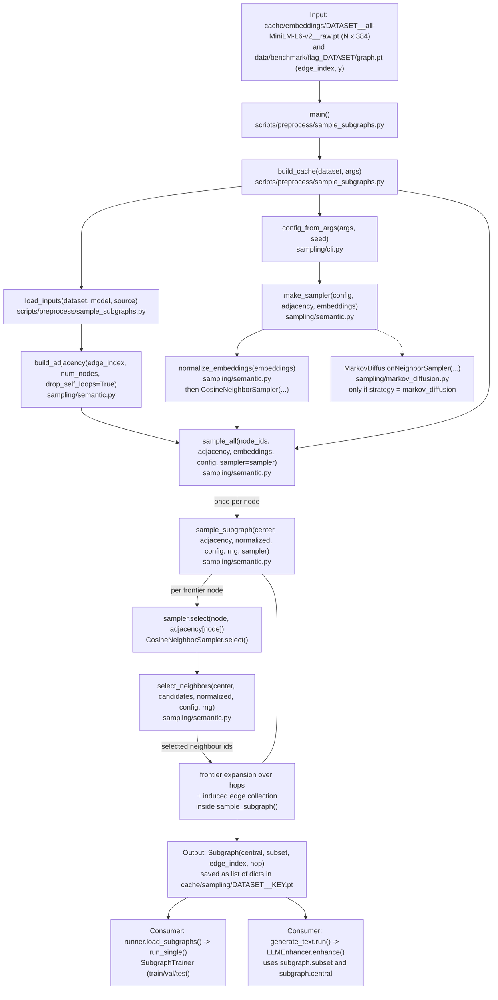
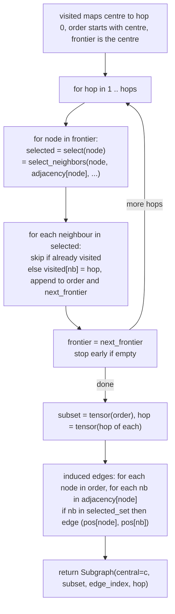
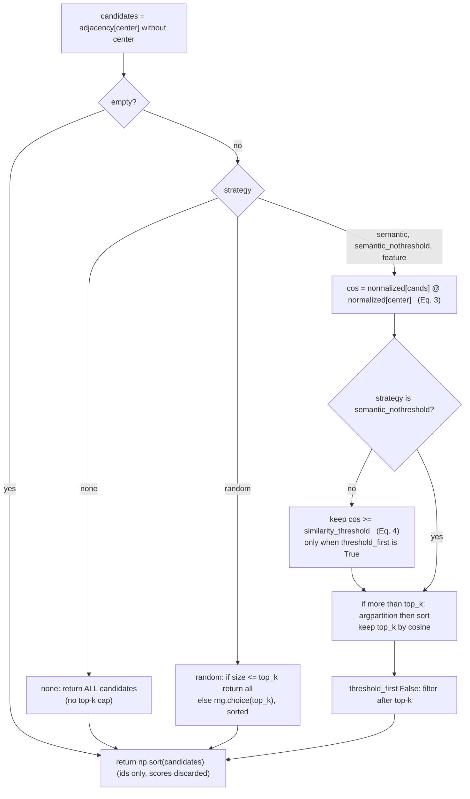

# 03 - Subgraph generation

[README](README.md) | [00 Master](00-master-workflow.md) | prev: [02](02-flag-pipeline.md) | next: [04 Representation and similarity](04-representation-and-similarity.md)

Everything below is in [semantic.py](../../src/flagbench/sampling/semantic.py) unless
stated, driven by [sample_subgraphs.py](../../scripts/preprocess/sample_subgraphs.py).

> **"1-hop" in this repository.** The default is `hops = 2` ([semantic.py:66](../../src/flagbench/sampling/semantic.py#L66)),
> `--hops` default 2 ([sample_subgraphs.py:292](../../scripts/preprocess/sample_subgraphs.py)),
> and the caches present (`cache/sampling/*_h2_*`) are 2-hop. A subgraph therefore
> contains the centre (hop 0), its selected neighbours (hop 1) and *their* selected
> neighbours (hop 2). The 1-hop part of every subgraph is the set
> `subset[hop == 1]`. A pure 1-hop subgraph is obtained with `--hops 1`
> (cache key `..._h1_...`); this has not been run here.

## 1. Chain of calls



Source links: [sample_subgraphs.py](../../scripts/preprocess/sample_subgraphs.py) -
[semantic.py](../../src/flagbench/sampling/semantic.py) -
[markov_diffusion.py](../../src/flagbench/sampling/markov_diffusion.py) -
[cli.py](../../src/flagbench/sampling/cli.py) -
[runner.py](../../src/flagbench/experiments/runner.py) -
[generate_text.py](../../scripts/llm/generate_text.py)

## 2. What one subgraph is, and how it is built

### Step-by-step for one centre node `c` (default config: hops 2, top-k 10, delta 0, per-hop)



(Source: `sample_subgraph`, [semantic.py:307-386](../../src/flagbench/sampling/semantic.py#L307).)

### `select_neighbors` decision logic ([semantic.py:222-270](../../src/flagbench/sampling/semantic.py#L222))



(`feature` uses the graph's stored `x` instead of Sentence-BERT; it is only used by
`sample_subgraphs.py --compare-strategies`. `markov_diffusion` bypasses this function
except to size its budget, see [04](04-representation-and-similarity.md).)

## 3. Answers to the specific questions

| Question | Answer (with evidence) |
|---|---|
| What is a graph node? | An integer id `0..N-1` of the benchmark graph = one Reddit/Instagram **user** (after re-indexing by `benchmark.induce_subgraph`). Per-node data live in separate arrays: `x` (4096-d stored features), `raw_texts[i]` (string), `y[i]` (label). The `Subgraph` object holds none of them. |
| What is an edge? | A column `(src, dst)` of `edge_index` (shape `2 x E`, `torch.long`). `build_adjacency` ([semantic.py:185](../../src/flagbench/sampling/semantic.py#L185)) groups `dst` by `src`. No edge attributes exist anywhere in this pipeline (`NOT FOUND IN REPOSITORY`). |
| How are neighbours obtained? | `adjacency[node]` = all `dst` with `src == node`, self-loops removed (`drop_self_loops=True`, called from `build_cache`), sorted stable by `src`. Then `select_neighbors` removes `center` again, and applies the strategy. |
| What exactly is "1-hop"? | See the box at the top. The `hop` tensor stores each node's hop of *first discovery* (`visited[nb] = hop`). |
| Is the centre included? | **Yes**, always: `visited = {center: 0}`, `order = [center]`, so `subset[0] == central` and `hop[0] == 0`. (The config field `include_center` exists but is never read.) `Subgraph.center_position()` finds it and raises if it is not present exactly once. |
| Are edges directed? | The code treats `edge_index` as **directed** lists: neighbours come from *outgoing* edges of a node, and the induced edges keep each `(node -> nb)` direction. Whether the stored GLBench graph is symmetric is `UNVERIFIED` in code; `research/dataset_notes.md:113-115` states it is (secondary document). |
| Are node/edge attributes retained? | **No.** `Subgraph` = `central`, `subset`, `edge_index`, `hop`. Features are looked up later by `features[subgraph.subset]` (`runner.make_feature_fn`, [runner.py:113](../../src/flagbench/experiments/runner.py#L113)). |
| What data structure is returned? | `Subgraph` dataclass ([semantic.py:146-164](../../src/flagbench/sampling/semantic.py#L146)); `sample_all` returns `list[Subgraph]`. On disk: `list[dict]` with keys `central, subset, edge_index, hop` (`build_cache`, [sample_subgraphs.py:239-250](../../scripts/preprocess/sample_subgraphs.py)), plus a `.json` stats file. |
| Which function consumes it? | `runner.load_subgraphs()` (rebuilds `Subgraph` objects) -> `run_single()` -> `split_subgraphs()` -> `SubgraphTrainer`; and `generate_text.run()` -> `LLMEnhancer.enhance()`. |

### Subtleties that are easy to miss (all verified in code)

1. **Hop-2 selection is relative to the hop-1 node, not to the original centre.**
   `select(node)` is called for every node in the frontier and uses `node` as
   `center` in `select_neighbors` ([semantic.py:346-347](../../src/flagbench/sampling/semantic.py#L346)).
   So hop-2 neighbours are the ones most similar to their hop-1 parent (GraphSAGE-style).
2. **The induced edge set is *all* edges among the selected nodes**, not just the
   selection edges ([semantic.py:367-382](../../src/flagbench/sampling/semantic.py#L367)). Two hop-2 nodes, or a hop-2 node
   and the centre, are connected if an edge exists in `adjacency`, even though neither was "selected" through it.
3. **No self-loops in the subgraph** (removed at `build_adjacency`). GNN layers add their own where needed (e.g. `GCNConv`, `CAREGNNLayer`).
4. **`top_k` is per node expanded** (`per_hop=True`), so a 2-hop subgraph can hold up to `1 + 10 + 10*10 = 111` nodes. With `per_hop=False` the budget `top_k` is shared across the whole expansion.
5. **Baselines use `strategy="none"`**: `select_neighbors` returns all neighbours with **no cap**,
   so `baseline`/`text` subgraphs are the plain (frontier-expanded) 2-hop neighbourhood and can be much bigger.
6. **Isolated centres** give a one-node subgraph with an empty `edge_index` (`torch.zeros((2, 0))`), reported by `sampling_stats()["isolated_centers"]`.
7. **Every node gets a subgraph** (`range(num_nodes)`, [sample_subgraphs.py:229-231](../../scripts/preprocess/sample_subgraphs.py)); the runner later picks those whose centre is in train/val/test via the masks.
8. **Labels are never used** to build subgraphs (`y` only feeds `subgraph_homophily` for the stats file).

### Observed in this checkout (from `cache/sampling/reddit__*.json`, written by `build_cache`)

| Cache | subgraphs | nodes/subgraph min / mean / median / max | edges/subgraph mean / max | isolated centres |
|---|---|---|---|---|
| `reddit__semantic_h2_k10_t0_perhop` (FLAG) | 18,389 | 1 / 8.95 / 6 / 85 | 18.83 / 368 | 3,690 |
| `reddit__none_h2_k10_t0_perhop` (baseline) | 18,389 | 1 / 12.59 / 7 / 235 | 30.43 / 1,128 | 3,108 |

The baseline maximum (235) exceeds the `1 + 10 + 100 = 111` ceiling of the
top-k rule, which confirms subtlety 5 (no cap for `none`). The semantic sampler has
582 more isolated centres than `none`: those nodes have neighbours, but none with
cosine >= 0, so the threshold removes them all.

## 4. Function records

```text
File:         scripts/preprocess/sample_subgraphs.py
Function:     build_cache(dataset: str, args) -> dict
Called by:    main() (sample_subgraphs.py:316)
Calls:        load_inputs, semantic.build_adjacency, config_from_args, semantic.make_sampler,
              semantic.sample_all, semantic.sampling_stats, semantic.subgraph_homophily, torch.save
Input:        dataset name; parsed args (hops, top_k, threshold, strategy, model, seed, force, MD options)
Processing:   builds adjacency (self-loops dropped), builds the sampler, samples a Subgraph for every
              node id, writes cache + JSON manifest; returns the cached manifest if the cache file exists and not --force
Return value: manifest dict (config, stats, homophily, seconds, output path, provenance)
Return type:  dict
Used by:      main() (result only printed / collected)
```

```text
File:         scripts/preprocess/sample_subgraphs.py
Function:     load_inputs(dataset: str, model: str, source: str = "benchmark")
Called by:    build_cache(), compare_strategies()
Calls:        torch.load (graph.pt or raw GLBench via glbench.load_raw)
Input:        dataset; embedding model name; source in {"benchmark","original"}
Processing:   loads the graph payload and cache/embeddings/DATASET__MODEL__raw.pt; raises if the
              embedding count != node count
Return value: (payload dict, embeddings Tensor)
Return type:  tuple[dict, torch.Tensor]  (embeddings: N x 384 float32)
Used by:      build_cache(), compare_strategies()
```

```text
File:         src/flagbench/sampling/semantic.py
Function:     build_adjacency(edge_index, num_nodes, drop_self_loops=True) -> list[np.ndarray]
Called by:    build_cache(), compare_strategies()  (also scripts/analyze/compare_samplers.py)
Calls:        numpy argsort / searchsorted
Input:        edge_index Tensor 2 x E; number of nodes
Processing:   drop src==dst edges, stable sort by src, split dst into one array per source node
Return value: adjacency[i] = np.ndarray of out-neighbour ids of node i
Return type:  list[np.ndarray]  (length num_nodes)
Used by:      make_sampler / sample_all / sample_subgraph
```

```text
File:         src/flagbench/sampling/semantic.py
Function:     make_sampler(config, adjacency, embeddings)
Called by:    build_cache(), sample_all() (if no sampler passed)
Calls:        normalize_embeddings, CosineNeighborSampler / MarkovDiffusionNeighborSampler
Input:        SamplingConfig; adjacency; embeddings (Tensor or None)
Processing:   markov_diffusion -> MarkovDiffusionNeighborSampler(adjacency, embeddings, config);
              otherwise L2-normalise embeddings (if given) and wrap in CosineNeighborSampler,
              with a numpy Generator only for strategy "random"
Return value: sampler object exposing select(center, candidates)
Return type:  CosineNeighborSampler | MarkovDiffusionNeighborSampler
Used by:      sample_all -> sample_subgraph
```

```text
File:         src/flagbench/sampling/semantic.py
Function:     sample_all(node_ids, adjacency, embeddings, config, progress=False, sampler=None)
Called by:    build_cache(), compare_strategies()
Calls:        make_sampler (if sampler None), sample_subgraph
Input:        iterable of centre ids; adjacency; embeddings; config; optional pre-built sampler
Processing:   calls sample_subgraph(int(n), adjacency, None, config, None, sampler=sampler) for each id
              (normalized and rng are None because the sampler owns them)
Return value: one Subgraph per input id, in input order
Return type:  list[Subgraph]
Used by:      build_cache()
```

```text
File:         src/flagbench/sampling/semantic.py
Function:     sample_subgraph(center, adjacency, normalized, config, rng=None, sampler=None) -> Subgraph
Called by:    sample_all()
Calls:        sampler.select(node, adjacency[node])   (or select_neighbors directly if sampler is None)
Input:        centre node id; adjacency; config (hops, top_k, per_hop); sampler
Processing:   frontier expansion (section 2), then induced edges among all selected nodes,
              re-indexed to positions in `subset`
Return value: Subgraph(central=center, subset=LongTensor[k], edge_index=LongTensor[2,E_sub], hop=LongTensor[k])
Return type:  Subgraph
Used by:      sample_all()
```

```text
File:         src/flagbench/sampling/semantic.py
Function:     select_neighbors(center, candidates, normalized, config, rng=None) -> np.ndarray
Called by:    CosineNeighborSampler.select(); sample_subgraph (no-sampler path);
              MarkovDiffusionNeighborSampler.budget() (only to size k)
Calls:        numpy / torch ops (matmul, argpartition, argsort)
Input:        node id; its candidate neighbour ids; L2-normalised embeddings (or None); config
Processing:   Eq. 3-4 (see decision diagram); ids only
Return value: selected neighbour ids, ascending, never containing `center`
Return type:  np.ndarray[int]
Used by:      sample_subgraph()
```

```text
File:         src/flagbench/experiments/runner.py
Function:     load_subgraphs(dataset: str, config: SamplingConfig) -> list[Subgraph]
Called by:    run_single(); scripts/llm/generate_text.py (run, reuse_split)
Calls:        torch.load(cache/sampling/DATASET__KEY.pt)
Input:        dataset; SamplingConfig (its cache_key() names the file)
Processing:   rebuilds Subgraph objects from the saved dicts; raises FileNotFoundError with the command to run if missing
Return value: list of Subgraph
Return type:  list[Subgraph]
Used by:      split_subgraphs() (by centre id), LLMEnhancer.enhance()
```

Cache file naming: `SamplingConfig.cache_key()` ([semantic.py:114](../../src/flagbench/sampling/semantic.py#L114))
= `strategy_h{hops}_k{top_k}_t{threshold}_perhop|total` (+ extras for `random` / `markov_diffusion`),
e.g. `reddit__semantic_h2_k10_t0_perhop.pt`.
