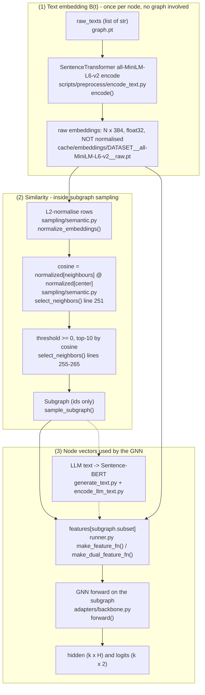
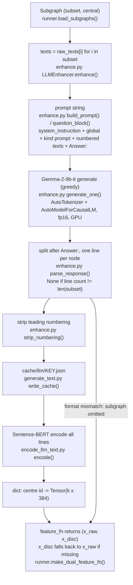

# 04 - Representation and similarity

[README](README.md) | [00 Master](00-master-workflow.md) | prev: [03 Subgraph](03-subgraph-generation.md) | next: [05 Features and detection](05-feature-and-detection-pipeline.md)

## 1. The actual order (not "subgraph -> embedding -> similarity")

The repository computes vectors in **three separate places**, and cosine similarity
sits in the first one - *before* subgraphs exist:



Nothing after step (2) computes a similarity, and the similarity value never leaves
`select_neighbors`.

## 2. Vector inventory

| Vector | Made by (file:function) | Shape / dtype | Model / transformation | Normalised? | Consumed by |
|---|---|---|---|---|---|
| Stored node features `x` | GLBench file, copied by `benchmark.build()` | `N x 4096` (measured; README/dataset_notes say Llama-2-derived, the `baseline` variant only) | none | no | `make_feature_fn` (`baseline`) |
| Raw-text embedding | [encode_text.py:encode()](../../scripts/preprocess/encode_text.py) -> `SentenceTransformer(...).encode(texts, batch_size=64, convert_to_numpy=True, normalize_embeddings=False)` | `N x 384` float32 (confirmed: `cache/embeddings/reddit__all-MiniLM-L6-v2__raw.json` `"dim": 384`, `"num_texts": 18389`) | `all-MiniLM-L6-v2`; tokenisation and pooling are **internal to the sentence-transformers library** (`UNVERIFIED` from repo code alone) | no (explicitly `False`) | sampler (Eq. 3), `+text` features, `+FLAG` raw branch |
| Normalised embedding | [semantic.py:normalize_embeddings()](../../src/flagbench/sampling/semantic.py#L208) | `N x 384` | each row divided by its L2 norm (a norm of 0 is replaced by 1, so zero rows stay zero) | yes (L2) | `select_neighbors` only (in memory, never saved) |
| LLM text (strings) | [enhance.py:LLMEnhancer.enhance()](../../src/flagbench/llm/enhance.py#L293) | `dict[centre id -> list[str]]`, `k` strings per subgraph | Gemma-2-9b-it via `AutoTokenizer` + `AutoModelForCausalLM.generate` | - | `encode_llm_text.encode()` |
| LLM-text embedding | [encode_llm_text.py:encode()](../../scripts/preprocess/encode_llm_text.py) | `dict[int, Tensor(k x 384)]`, `k = len(subgraph.subset)` | same Sentence-BERT | no | `make_dual_feature_fn` |
| GNN hidden `x32` | upstream class `forward` via `FlagBundledBackbone.forward()` | `k x H` (see table below) | 2-layer GNN hidden state | no | t-SNE in paper; in this repo only `SubgraphTrainer.embeddings()` (no caller) and `orthogonal_loss` in `finetune_extra` |
| Logits | same | `k x 2` | GNN output (+ skip for some backbones) | no | centre row -> loss / softmax |
| Fused hidden/logits | `models.py:DualGNN.forward()` | `k x H`, `k x 2` | learned 2-way softmax mixture of the two branches | no | same as above |

### GNN hidden size `H` per backbone (from the classes in `methods/flag/`)

| Backbone | class | `x32` returned | H at `--hidden-dim 32` |
|---|---|---|---|
| GCN | `models.GCN` | `conv1(...).relu()` | 32 |
| GAT | `models.GAT` | `conv1 = GATConv(in, hidden, 8)` (8 heads, concatenated) then relu | 8 x 32 = 256 |
| GeniePath | `geniepath.GeniePathLazy` | last LSTM output (`lstm_hidden = 256`, module global) | 256 (ignores `--hidden-dim`) |
| BWGNN | `bwgnn.BWGNN` | `act(linear3(concat))` | 32 |
| CARE-GNN | `caregnn.CAREGNN` | `relu(conv1)` | 32 |
| DGA-GNN | `dga.DGA` | layer output when `len(x[0]) == 32` | 32 (raises at other sizes) |
| PMP | `pmp.LASAGE_S` | same `== 32` guard | 32 (raises at other sizes) |

## 3. Cosine similarity - full trace

```mermaid
flowchart LR
    A["Raw-text embeddings, N x 384<br/>cache/embeddings/DATASET__all-MiniLM-L6-v2__raw.pt<br/>loaded by sample_subgraphs.py load_inputs()"]
    B["normalize_embeddings()<br/>sampling/semantic.py:208<br/>called from make_sampler()"]
    C["CosineNeighborSampler.normalized<br/>sampling/semantic.py:273"]
    D["select_neighbors(center, candidates, normalized, config)<br/>sampling/semantic.py:222"]
    E["center_vec = normalized[center]<br/>neighbor_vecs = normalized[candidates]<br/>sims = neighbor_vecs @ center_vec<br/>line 251 (torch matmul, no sklearn / scipy)"]
    F["keep sims >= similarity_threshold (line 256)<br/>top-k by sims via argpartition (lines 261-265)"]
    G["returns np.sort(selected ids)<br/>the sims array is dropped here"]
    H["sample_subgraph() frontier expansion"]

    A --> B --> C --> D --> E --> F --> G --> H
    click B "../../src/flagbench/sampling/semantic.py" "source"
    click D "../../src/flagbench/sampling/semantic.py" "source"
```



| Item | Value |
|---|---|
| Exact file | [src/flagbench/sampling/semantic.py](../../src/flagbench/sampling/semantic.py) |
| Exact function | `select_neighbors()` (calculation at line 251); `normalize_embeddings()` (line 208) makes it a dot product |
| Caller | `CosineNeighborSampler.select()` ([line 286](../../src/flagbench/sampling/semantic.py#L286)) <- `sample_subgraph()` <- `sample_all()` <- `build_cache()` |
| Inputs | `center` id; `candidates` = `adjacency[center]` minus centre; `normalized` (N x 384, unit rows); `SamplingConfig` |
| Vector origin | Sentence-BERT raw-text embeddings - **not** GNN outputs, **not** LLM text |
| Calculation | `(neighbor_vecs @ center_vec)`; equals cosine because rows are unit length (a unit test checks it against `torch.nn.functional.cosine_similarity`: `tests/unit/test_semantic_sampling.py:58-63`). A zero row stays zero, so its similarity is 0 to everything. |
| Library / API | `torch.Tensor.__matmul__` only; the "Repository function -> library -> next function" chain is `select_neighbors` -> `torch @` -> `select_neighbors` |
| Returned | Similarity array is **local**; the function returns only the selected ids (`np.ndarray`, sorted ascending) |
| Consumer of the score | Only the two lines that use `sims`: the delta filter `sims >= similarity_threshold` and the top-k `argpartition(-sims, ...)`. After that the score is discarded. It is not stored in `Subgraph`, the cache, or any feature. |
| Configuration | `similarity_threshold=0.0`, `top_k=10`, `threshold_first=True` (`SamplingConfig`, [semantic.py:62-93](../../src/flagbench/sampling/semantic.py#L62)) |

### Other places a "cosine" or "similarity" appears (none feed features)

| Where | What it is | Is it the FLAG sampler's cosine? |
|---|---|---|
| `methods/flag/utils.py:orthogonal_loss` (UPSTREAM REFERENCE; used by upstream `train.py`) | `sum(normalize(a) * normalize(b))`, a *signed cosine* between two GNN centre-node hidden vectors, used as a loss term | no - different vectors and purpose |
| [flag_losses.py:orthogonal_loss](../../src/flagbench/training/flag_losses.py#L43) `mode="signed_cosine"` | the same signed cosine, as an option. **Default mode is `squared_dot`** (`FinetuneConfig.orthogonality`), which is *not* cosine | no |
| `methods/flag/caregnn.py:CAREGNNLayer.message` | `sigmoid(mlp(concat(x_i, x_j)))` - a learned gate; the code comment calls it "pairwise similarity" | no - not cosine |
| `models.py:DualGNN.forward` | `softmax(attention_weights)` over the two branches | no - a learned mixture, not similarity |
| [scripts/analyze/compare_samplers.py:cosine_scores](../../scripts/analyze/compare_samplers.py) | analysis of sampler neighbourhoods | reuses the cosine idea for diagnostics only |
| [markov_diffusion.py](../../src/flagbench/sampling/markov_diffusion.py) | FLAG-MD: ranks by the L2 norm of (H_w minus H_u); calls `select_neighbors` only in `budget()` to decide *how many* to keep (`md_selection="matched_cosine"`) | replaces the ranking; cosine only sizes the budget |

## 4. LLM text -> vectors (the `+FLAG` branch)



- Tokenizer: Gemma's `AutoTokenizer.from_pretrained(config.model_id)`
  ([enhance.py:248-275](../../src/flagbench/llm/enhance.py#L248)); it exists only in this
  LLM stage. Sentence-BERT's tokenizer is internal to the library (`UNVERIFIED`).
- Input shape to Gemma: one prompt string per subgraph (`batch_prompts=1`).
- Output: text, not a tensor. The vector is made afterwards by Sentence-BERT.
- Prompts come from `prompts/DATASET/{system_instruction,global,discriminative,residual}.txt`
  via `PromptSet.load()`. Their wording is upstream's (`chat.py` / `chat1.py`), which uses
  "causal / non-causal" language, not the paper's Table 1 wording (see [08](08-paper-to-code.md)).
- Fallback: if the subgraph's text failed the format check (or its length differs from
  `len(subset)`), `x_disc = x_raw` ([runner.py:202-206](../../src/flagbench/experiments/runner.py#L202)).
  Coverage of generated text in the production caches (550-token budget, D-005) is 55-74% on Reddit, 9-22% on
  Instagram and at least 96% on Amazon, YelpChi and Amazon Video, so Instagram `flag` results lean mostly on this
  fallback. (`cache/llm/` is empty in this checkout, so these figures come from the README and the main-run report, not
  from a file inspected here. The earlier 0.6%-12.4% figure was the superseded 64-token cache, D-004.)

## 5. Function records

```text
File:         scripts/preprocess/encode_text.py
Function:     encode(dataset: str, args) -> dict | None
Called by:    main()
Calls:        load_texts, texts_fingerprint, resolve_device, SentenceTransformer, encoder.encode, torch.save
Input:        dataset name; args (model, device, batch_size, force, source)
Processing:   loads raw_texts from graph.pt, skips if a cache with the same text fingerprint exists,
              encodes all texts with Sentence-BERT, saves float32 tensor + JSON metadata
Return value: metadata dict (dim, num_texts, empty_texts, texts_sha256, ...) or None if graph.pt missing
Return type:  dict | None
Used by:      main() prints summary; the .pt is read by sample_subgraphs.load_inputs and runner.load_text_embeddings
```

```text
File:         src/flagbench/sampling/semantic.py
Function:     normalize_embeddings(embeddings: torch.Tensor) -> torch.Tensor
Called by:    make_sampler(); MarkovDiffusionNeighborSampler.__init__
Calls:        Tensor.norm, torch.where
Input:        N x d tensor
Processing:   divide each row by its L2 norm (norm 0 replaced by 1, so zero rows stay zero)
Return value: N x d tensor with unit (or zero) rows
Return type:  torch.Tensor
Used by:      CosineNeighborSampler.normalized -> select_neighbors
```

```text
File:         scripts/preprocess/encode_llm_text.py
Function:     encode(dataset: str, kind: str, args) -> dict | None
Called by:    main()
Calls:        _llm_cache_key, resolve_device, SentenceTransformer.encode, torch.save
Input:        dataset; kind in {discriminative, residual}; args (must match generate_text's decode settings)
Processing:   reads cache/llm/KEY.json (+ manifest), flattens lines across subgraphs, encodes, re-splits per subgraph
Return value: metadata dict, or None if the LLM cache is missing
Return type:  dict | None
Used by:      main(); the .pt is read by runner.load_llm_embeddings
```
