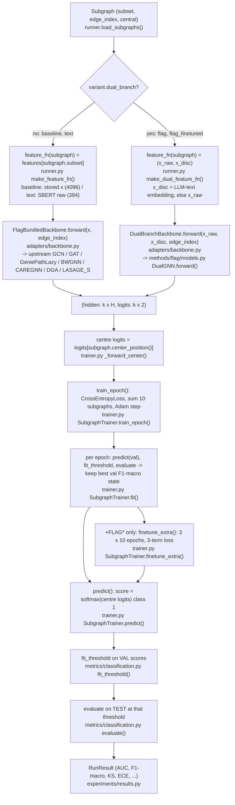
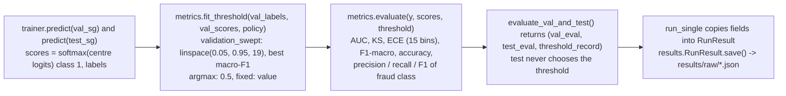

# 05 - Feature construction and detection

[README](README.md) | [00 Master](00-master-workflow.md) | prev: [04 Representation](04-representation-and-similarity.md) | next: [06 Call graph](06-function-call-graph.md)

## 0. What "feature" and "detection" mean in this code

- **Features** = which per-node vectors are gathered for a subgraph. There is no
  hand-built feature vector and **no similarity-derived feature**. The variant decides which
  precomputed embeddings are indexed by `subgraph.subset`.
- **Detection** = **supervised binary node classification** of the subgraph's *centre* node
  (2-class cross-entropy). The "anomaly score" is the fraud-class probability
  `softmax(logits)[1]`. Labels: `1` = minority/fraud class (`Popular Users` on Reddit,
  `Commercial Users` on Instagram, per `BenchmarkConfig` docstring).

## 1. Diagram



## 2. Feature construction per variant

| Variant | `feature_fn(subgraph)` returns | Built in | Fallbacks |
|---|---|---|---|
| `baseline` | `payload["x"][subgraph.subset]`, `k x 4096` | `make_feature_fn` (`feature_source == "stored"`) | - |
| `text` | `load_text_embeddings(dataset)[subgraph.subset]`, `k x 384` | `make_feature_fn` (`"lm_text"`) | - |
| `flag`, `flag_finetuned` | `(x_raw, x_disc)`, each `k x 384` | `make_dual_feature_fn` | `x_disc = x_raw` when the subgraph has no generated text or its length differs from `k` |
| `flag_finetuned` extra | `(x_disc, x_common)` or `None` | `extra_feature_fn` in `make_dual_feature_fn` | `None` (subgraph skipped in the extra phase) if either text is missing |

`in_dim` (4096 or 384) is read from the tensor (`int(features.shape[1])`) and passed to `build_backbone`.

## 3. The GNN forward (representation -> logits)

- Single-branch (`baseline`, `text`): `FlagBundledBackbone.forward` calls the upstream class as
  `self.net(x, edge_index)` and requires a 2-tuple `(hidden, logits)`; otherwise it raises `TypeError`
  ([backbone.py:253-264](../../src/flagbench/adapters/backbone.py#L253)).
- Dual-branch (`flag*`): `DualBranchBackbone` builds `models.DualGNN(out_dim, backbone.net)` - **one** GNN instance
  used for both branches ([backbone.py:284-310](../../src/flagbench/adapters/backbone.py#L284)):

```text
x321, out1 = gnn(x1, edge_index)         # x1 = raw-text branch       hidden (k,H), logits (k,2)
x322, out2 = gnn(x2, edge_index)         # x2 = discriminative branch
concat32   = stack([x321, x322], dim=1)  # (k, 2, H)
concat     = stack([out1, out2], dim=1)  # (k, 2, 2)
attn       = softmax(attention_weights, dim=1)   # Parameter shape (1, out_channels=2) -> (1, 2)
out32      = matmul(attn, concat32).squeeze(1)   # (k, H)
weighted   = matmul(attn, concat).squeeze(1)     # (k, 2)     <- these are the logits
```

Consequences read straight from the code (`methods/flag/models.py:23-39`):
the "attention" is **one learned pair of weights shared by every node** (not per-node attention); it
type-checks only because `out_channels == 2 == number of branches`; `self.linear1 = Linear(384, out_channels)` is
defined but unused. Shapes above are inferred from the tensor operations, not from a run.

Skip connection (paper Eq. 6, `Z = GNN(X, A) + Linear(X)`): present in `GCN`, `GeniePathLazy`, `BWGNN`
(`return ..., x + initial_x`); computed-and-discarded in `GAT`, `CAREGNN`, `DGA`, `LASAGE_S`.

## 4. Training loop - `SubgraphTrainer` ([trainer.py](../../src/flagbench/training/trainer.py))

| Step | Code |
|---|---|
| example | one subgraph = one example; loss on the centre node only (`_forward_center` returns `logits[subgraph.center_position()]`) |
| loss | `torch.nn.CrossEntropyLoss()` (unweighted unless `--class-weighted-loss`) on 2 logits |
| batching | losses of 10 subgraphs are **summed** (not averaged) then one `backward()` + `optimizer.step()`; counter is the `enumerate` index, remainder flushed at epoch end |
| optimiser | Adam, lr 0.01, weight decay 0 (`TrainConfig`) |
| epochs | 5 by default (`--epochs`) |
| shuffling | `rng.shuffle(order)` each epoch, `rng = default_rng(stream "batch_order")` |
| model selection | each epoch: `predict(val)` -> `fit_threshold` -> `evaluate` -> `selection_metric = f1_macro`; strictly better -> `best_state = deepcopy(state_dict)` |
| early stopping | implemented (`patience`, default 10) but **cannot trigger at the default 5 epochs** (at most 4 non-improving epochs) |
| final model | `load_state_dict(best_state)` at the end of `fit()` |

### `+FLAG*` phase: `finetune_extra()` ([trainer.py:335-458](../../src/flagbench/training/trainer.py#L335))

Only for `variant.requires_finetuned_llm`. The LLM is frozen; only GNN parameters train.

```text
for outer in 3: for inner in 10:                     # FinetuneConfig.outer_epochs / inner_epochs
    for each usable subgraph (both texts present):
        disc_hidden,   disc_logits   = backbone(x_disc,   edge_index)   # shared single GNN
        common_hidden, common_logits = backbone(x_common, edge_index)
        loss = CE(disc_logits[c], y)
             + 0.1 * non_causal_loss(common_logits[c])                  # KL(softmax || uniform)
             + 0.1 * orthogonal_loss(disc_hidden[c], common_hidden[c])  # default 'squared_dot'
    sum 10 losses per step via self._step(); evaluate on val; keep best
```

> **Code observation (from reading, not from a run):** `finetune_extra` builds a local
> `optimizer = Adam(..., lr=config.lr)` ([trainer.py:388-390](../../src/flagbench/training/trainer.py#L388))
> but only calls `optimizer.zero_grad()` on it. The parameter update happens in
> `self._step()`, which steps **`self.optimizer`** - the one built in `__init__` from
> `TrainConfig` (lr 0.01 by default). So `FinetuneConfig.lr = 1e-4` (and its weight decay)
> appear to have **no effect**, while `run_single` still records `ft_lr` in the result's
> `hyperparameters`. `UNVERIFIED` by execution.

It starts from the checkpoint `fit()` produced and keeps the extra-epoch model only if it beats it on validation
(`outcome.best_epoch > 0` in `run_single`, [runner.py:370](../../src/flagbench/experiments/runner.py#L370)). The backbone is called directly, so the
fused `attention_weights` are not part of this loss (inferred from code).
The losses are [flag_losses.py](../../src/flagbench/training/flag_losses.py).

## 5. Scoring and evaluation



- `evaluate()` has no `policy` argument by design; only `fit_threshold()` searches, and `evaluate_val_and_test()`
  calls it on validation data ([classification.py:305-319](../../src/flagbench/metrics/classification.py#L305)).
- Tie-breaking in the sweep: `max(..., key=(f1, -threshold))` -> among equal F1 the lower threshold wins.
- AUC/KS/ECE do not depend on the threshold. ECE and KS are extra to the paper's F1/AUC (KS is the paper's industrial metric).
- Output artefacts: `results/raw/DATASET__MODEL__VARIANT__s{seed}i{init}__{id}.json`, then
  `results/aggregated/results.{csv,json}` and `results/tables/comparison.md`
  ([results.py](../../src/flagbench/experiments/results.py)).

## 6. Function records

```text
File:         src/flagbench/experiments/runner.py
Function:     make_feature_fn(variant_key: str, payload: dict, dataset: str)
Called by:    run_single() (non-dual variants)
Calls:        get_variant, load_text_embeddings
Input:        variant key; graph payload; dataset name
Processing:   chooses the feature tensor by variant.feature_source ("stored" -> payload["x"], "lm_text" -> SBERT raw);
              raises ExperimentNotAvailable for a dual-branch variant
Return value: (feature_fn, in_dim, description); feature_fn(subgraph) = features[subgraph.subset]
Return type:  tuple[Callable[[Subgraph], Tensor], int, str]
Used by:      SubgraphTrainer (as its feature_fn); build_backbone (in_dim)
```

```text
File:         src/flagbench/experiments/runner.py
Function:     make_dual_feature_fn(variant_key, payload, dataset, sampling=None)
Called by:    run_single() (variant.dual_branch)
Calls:        load_text_embeddings, load_llm_embeddings("discriminative"), load_llm_embeddings("residual") if requires_finetuned_llm
Input:        variant key; payload; dataset; SamplingConfig (selects which LLM cache)
Processing:   builds feature_fn -> (x_raw, x_disc) with fallback x_disc = x_raw, and extra_feature_fn -> (x_disc, x_common) | None
Return value: (feature_fn, extra_feature_fn | None, in_dim, description)
Return type:  tuple[Callable, Callable | None, int, str]
Used by:      SubgraphTrainer.fit() (feature_fn), SubgraphTrainer.finetune_extra() (extra_feature_fn)
```

```text
File:         src/flagbench/adapters/backbone.py
Function:     build_backbone(model_key, in_dim, out_dim=2, hidden_dim=32, dropout=0.5, device="cpu", dual_branch=False)
Called by:    run_single()
Calls:        FlagBundledBackbone(...), DualBranchBackbone(...)
Input:        model key (registry), feature dim, hidden size, dropout, device, dual flag
Processing:   imports the upstream class named in ModelSpec.module from methods/flag/ (importlib), constructs it
              (GeniePathLazy takes a device string; gcn/gat take dropout), applies the DGA dim_size repair, wraps for dual
Return value: BaseBackbone whose forward returns (hidden, logits)
Return type:  FlagBundledBackbone | DualBranchBackbone
Used by:      SubgraphTrainer as `model`
```

```text
File:         src/flagbench/training/trainer.py
Function:     SubgraphTrainer.fit(train_subgraphs, val_subgraphs, seed=0) -> TrainingOutcome
Called by:    run_single()
Calls:        train_epoch, predict, metrics.fit_threshold, metrics.evaluate
Input:        lists of Subgraph for train and val; batch-order seed
Processing:   epoch loop described in section 4; deep-copies the best state; restores it at the end
Return value: TrainingOutcome(best_epoch, best_val_metric, history, stopped_early, epochs_run, training_seconds, best_state)
Return type:  TrainingOutcome
Used by:      run_single() (fields copied into RunResult)
```

```text
File:         src/flagbench/training/trainer.py
Function:     SubgraphTrainer.predict(subgraphs) -> (np.ndarray, np.ndarray)
Called by:    fit(), finetune_extra(), run_single()
Calls:        _forward_center
Input:        list of Subgraph
Processing:   model.eval(), no_grad; float(softmax(centre logits)[1]) and the true label of each centre
Return value: (fraud scores, integer labels), one entry per subgraph, in input order
Return type:  tuple[np.ndarray, np.ndarray]
Used by:      metrics.evaluate_val_and_test (through run_single)
```
