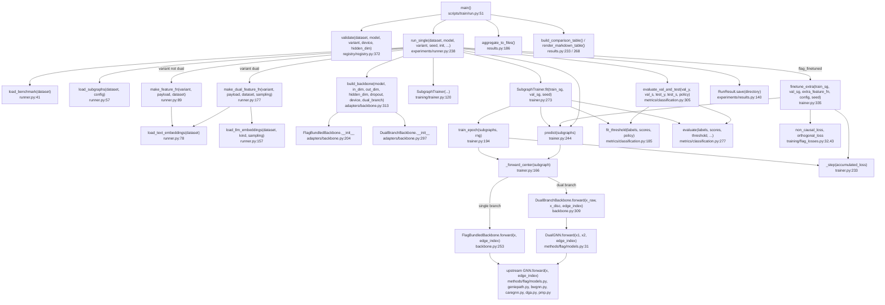
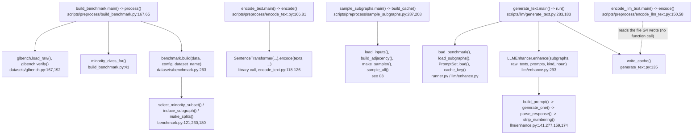
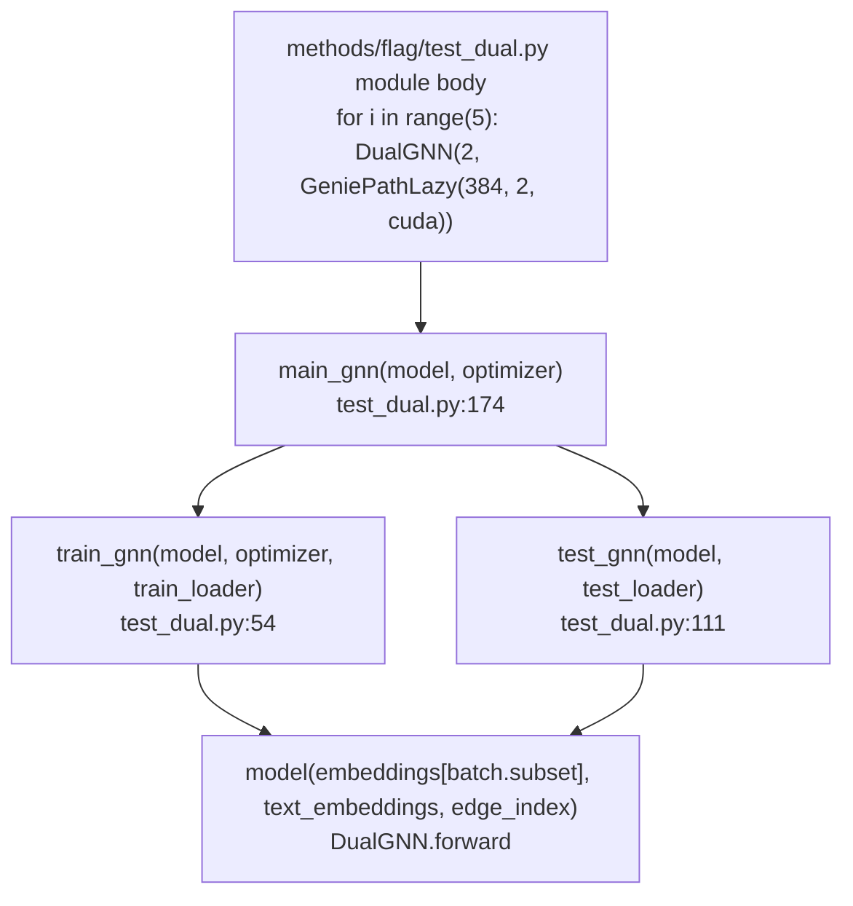

# 06 - Function call graph

[README](README.md) | [00 Master](00-master-workflow.md) | prev: [05](05-feature-and-detection-pipeline.md) | next: [07 Data flow](07-data-flow.md)

Only functions that participate in the FLAG pipeline are listed; trivial helpers are omitted.
Every edge below was read from a call site (line numbers given).

## 1. Training / evaluation chain (entry: `scripts/train/run.py`)



## 2. Preparation chain (entry: each `scripts/preprocess/*` and `scripts/llm/*` script)



The two diagrams meet only through files on disk (see [07](07-data-flow.md)); no
function in the training chain calls a preparation function, except that
`generate_text.py` imports `runner.load_benchmark` / `runner.load_subgraphs` and
`encode_llm_text.py` imports `runner.PRODUCTION_LLM_CONFIG`.

## 3. Function records - training chain

```text
File:         scripts/train/run.py
Function:     main(argv=None) -> int
Signature:    main(argv: list[str] | None = None) -> int
Called by:    __main__ (sys.exit(main()))
Calls:        parse_list, TrainConfig(...), config_from_args (only if --sampling-strategy), registry.validate,
              runner.run_single, results.aggregate_to_files, results.build_comparison_table, results.render_markdown_table
Input:        CLI: --dataset --model --variant --seeds --inits --device --epochs --lr --hidden-dim --dropout
              --accumulation-steps --patience --threshold-policy --hops --top-k --threshold --sampling-strategy
              --results-dir --dry-run ...
Output:       stdout report; results/raw/*.json (via run_single); aggregates and comparison.md unless --results-dir
Return type:  int exit code (0 ok; 1 if failures or nothing runnable)
Purpose:      expand the (dataset x model x variant x seed x init) grid, refuse invalid cells up front, run each cell
```

```text
File:         src/flagbench/registry/registry.py
Function:     validate(dataset, model, variant="baseline", device="cpu", hidden_dim=None) -> ValidationResult
Called by:    run.py:main (per combo), runner.run_single
Calls:        get_dataset, get_model, get_variant
Input:        keys and device/hidden size
Output:       ValidationResult(ok, reasons, suggestions); truthy iff ok
Return type:  ValidationResult
Purpose:      block FLAG variants on text-free datasets, unobtainable data, hidden_dim != 32 for DGA-GNN/PMP
```

```text
File:         src/flagbench/experiments/runner.py
Function:     run_single(dataset, model, variant="baseline", seed=0, init=0, device="cpu", train_config=None,
                         sampling_config=None, finetune_config=None, save_checkpoint=False, save_result=True,
                         results_dir=None) -> RunResult
Called by:    run.py:main (line 173)
Calls:        get_model/get_variant/get_dataset, validate, resolve_device, RunIdentity, RunResult.new,
              load_benchmark, load_subgraphs, _record_sampling_cost, make_dual_feature_fn | make_feature_fn,
              seed_everything, fork_rng, build_backbone, SubgraphTrainer, trainer.fit, trainer.finetune_extra,
              trainer.predict, metrics.evaluate_val_and_test, RunResult.save
Input:        run coordinates + configs
Output:       RunResult with metrics and provenance fields; JSON on disk if save_result
Return type:  RunResult (status "completed" or "failed"); raises only ExperimentNotAvailable
Purpose:      the whole of one experiment; every variant goes through this same function
```

```text
File:         src/flagbench/experiments/runner.py
Function:     load_benchmark(dataset: str) -> dict
Called by:    run_single, scripts/llm/generate_text.py:run
Calls:        torch.load(data/benchmark/flag_DATASET/graph.pt), json (dataset_manifest.json)
Output:       payload keys x, edge_index, y, raw_texts, train_mask, val_mask, test_mask, original_node_ids, label_names, _manifest
Return type:  dict
Purpose:      load the built benchmark; FileNotFoundError names the build command
```

```text
File:         src/flagbench/experiments/runner.py
Function:     load_text_embeddings(dataset: str, model: str = "all-MiniLM-L6-v2")
Called by:    make_feature_fn, make_dual_feature_fn
Calls:        torch.load(cache/embeddings/DATASET__all-MiniLM-L6-v2__raw.pt)
Return type:  torch.Tensor (N x 384)
```

```text
File:         src/flagbench/experiments/runner.py
Function:     load_llm_embeddings(dataset: str, kind: str, sampling: SamplingConfig | None = None) -> dict[int, Tensor]
Called by:    make_dual_feature_fn
Calls:        _llm_embeddings_path (recomputes the cache key from PromptSet.load, LLMConfig(**PRODUCTION_LLM_CONFIG), sampling.cache_key()), torch.load
Return type:  dict[int, Tensor[k, 384]] keyed by centre node id, k = len(subgraph.subset)
Purpose:      locate the LLM-text embeddings that match the CURRENT prompts / sampler / decode settings
```

```text
File:         src/flagbench/adapters/backbone.py
Function:     FlagBundledBackbone.forward(x, edge_index)
Called by:    SubgraphTrainer._forward_center (single-branch variants); DualGNN (as self.gnn) for dual variants
Calls:        self.net(x, edge_index) - upstream GCN | GAT | GeniePathLazy | BWGNN | CAREGNN | DGA | LASAGE_S
Input:        x (k x in_dim), edge_index (2 x E_sub)
Output:       (hidden, logits)
Return type:  tuple[Tensor, Tensor]; raises TypeError if upstream returns a single tensor
```

```text
File:         methods/flag/models.py   (UPSTREAM REFERENCE, imported by adapters/backbone.py)
Function:     DualGNN.forward(self, x1, x2, edge_index)
Called by:    DualBranchBackbone.forward
Calls:        self.gnn(x1, edge_index), self.gnn(x2, edge_index), F.softmax, torch.matmul
Input:        raw-text features, discriminative-text features, edges
Output:       (fused hidden k x H, fused logits k x 2)
Return type:  tuple[Tensor, Tensor]
Purpose:      shared-parameter two-branch fusion with one learned 2-weight softmax (see 05)
```

```text
File:         src/flagbench/training/trainer.py
Function:     SubgraphTrainer._forward_center(self, subgraph)
Called by:    train_epoch, predict, embeddings (no caller)
Calls:        self.feature_fn(subgraph), self.model(...), subgraph.center_position()
Output:       logits of the centre node
Return type:  Tensor of shape (2,)
```

```text
File:         src/flagbench/training/trainer.py
Function:     SubgraphTrainer.train_epoch(self, subgraphs, rng=None) -> tuple[float, float]
Called by:    fit
Calls:        _forward_center, self.criterion, _step
Output:       (mean train loss, train F1-macro)
Purpose:      one pass; accumulate 10 losses per optimiser step; shuffle with rng
```

```text
File:         src/flagbench/training/trainer.py
Function:     SubgraphTrainer.finetune_extra(self, train_subgraphs, val_subgraphs, extra_feature_fn, config, seed=0)
Called by:    run_single (only if variant_spec.requires_finetuned_llm)
Calls:        extra_feature_fn, predict, fit_threshold, evaluate, non_causal_loss, orthogonal_loss, _step
Output:       (TrainingOutcome, stats dict with usable subgraph counts)
Return type:  tuple[TrainingOutcome, dict]
Purpose:      decision D-001 substitute for LLM fine-tuning: extra GNN epochs under the 3-term loss
```

```text
File:         src/flagbench/metrics/classification.py
Function:     fit_threshold(y_true, scores, policy="validation_swept", grid=None, fixed_value=0.5) -> tuple[float, dict]
Called by:    SubgraphTrainer.fit, finetune_extra, evaluate_val_and_test
Return value: (threshold, record documenting the policy)
Purpose:      the ONLY function that searches for a threshold; call on validation data only
```

```text
File:         src/flagbench/metrics/classification.py
Function:     evaluate_val_and_test(val_y, val_scores, test_y, test_scores, policy="validation_swept", grid=None, ece_bins=15)
Called by:    run_single
Calls:        fit_threshold, evaluate (x2)
Return type:  tuple[EvaluationResult, EvaluationResult, dict]
Purpose:      fit threshold on val, apply once to test
```

```text
File:         src/flagbench/experiments/results.py
Function:     RunResult.save(self, directory=None) -> pathlib.Path      aggregate_to_files(raw_dir=None, out_dir=None) -> dict
Called by:    run_single                                                  run.py:main (line 205)
Purpose:      one JSON per run in results/raw/; then flat results.csv / results.json in results/aggregated/
```

## 4. Function records - preparation chain

```text
File:         scripts/preprocess/build_benchmark.py
Function:     process(dataset: str, args) -> dict | None
Called by:    main()
Calls:        glbench.load_raw, glbench.verify, minority_class_for, benchmark.BenchmarkConfig, benchmark.build, torch.save, glbench.sha256_file
Output:       data/benchmark/flag_DATASET/graph.pt and dataset_manifest.json
Return type:  manifest dict, or None if the raw file is missing
```

```text
File:         src/flagbench/datasets/benchmark.py
Function:     build(data, config: BenchmarkConfig, dataset_name="") -> tuple[BenchmarkGraph, dict]
Called by:    build_benchmark.process
Calls:        select_minority_subset, induce_subgraph, make_splits, _count_isolated
Processing:   keep all majority, downsample minority to |majority|/10, induce edges on kept nodes (re-indexed, self-loops dropped),
              stratified 10/10/80 masks
Return type:  (BenchmarkGraph, manifest dict)
```

```text
File:         scripts/llm/generate_text.py
Function:     run(dataset: str, kind: str, args) -> dict | None
Called by:    main()
Calls:        load_benchmark, load_subgraphs, PromptSet.load, cache_key, [reuse_split], LLMEnhancer, enhancer.enhance, write_cache / merge_shards
Input:        dataset, kind in {discriminative, residual}, sampler + decode args
Output:       cache/llm/KEY.json + KEY.manifest.json (SHA-256, coverage stats)
Return type:  manifest dict (or None for --dry-run)
```

```text
File:         src/flagbench/llm/enhance.py
Function:     LLMEnhancer.enhance(self, subgraphs, raw_texts, prompts, kind, noun="posts", progress=True)
Called by:    generate_text.run
Calls:        build_prompt, generate_one, parse_response, strip_numbering
Output:       ({central id: [one string per node in subset]}, GenerationStats)
Return type:  tuple[dict[int, list[str]], GenerationStats]
Purpose:      one prompt per subgraph; a wrong line count omits the subgraph rather than repairing it
```

The sampling functions (`build_cache`, `load_inputs`, `build_adjacency`, `make_sampler`,
`sample_all`, `sample_subgraph`, `select_neighbors`, `load_subgraphs`) are recorded in
[03](03-subgraph-generation.md); the embedding functions (`encode_text.encode`,
`normalize_embeddings`, `encode_llm_text.encode`) in [04](04-representation-and-similarity.md);
`make_feature_fn`, `make_dual_feature_fn`, `build_backbone`, `fit`, `predict` in [05](05-feature-and-detection-pipeline.md).

## 5. Upstream call chain (UPSTREAM REFERENCE, does not start as shipped)



Differences that matter when comparing to the reproduction: upstream loads pre-built
`*_sampler*.pt` batches (`NOT FOUND IN REPOSITORY`: nothing creates them), reads
`batch.unique_embeddings` if present else raw embeddings (same fallback the reproduction copies),
applies `F.sigmoid(output)[:, 1]` (not softmax) for AUC (`test_dual.py:88,158`), and selects the model by
validation F1 at `argmax`.
