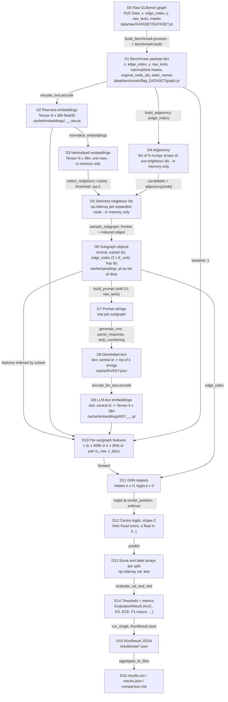

# 07 - Data flow

[README](README.md) | [00 Master](00-master-workflow.md) | prev: [06 Call graph](06-function-call-graph.md) | next: [08 Paper to code](08-paper-to-code.md)

What happens to the **data**, stage by stage. Only stages that exist in the code are shown.
`N` = number of nodes in the benchmark graph (Reddit: 18,389; measured from `cache/embeddings/reddit__all-MiniLM-L6-v2__raw.json`), `k` = nodes in one subgraph, `H` = GNN hidden size.

## Transformations

Each row: Before -> Function (File) -> After.

| # | Before | Function | File | After |
|---|---|---|---|---|
| 1 | Google-Drive `.pt` | `glbench.download()`, `load_raw()`, `verify()` | [glbench.py](../../src/flagbench/datasets/glbench.py) | `data/raw/DATASET/DATASET.pt`; PyG `Data` in memory (mask lists normalised to tensors) |
| 2 | raw graph (`y`, `x`, `edge_index`, `raw_texts`) | `select_minority_subset()` | [benchmark.py:121](../../src/flagbench/datasets/benchmark.py#L121) | sorted kept node ids: all majority + minority downsampled to `\|majority\|/10` |
| 3 | `edge_index` on original ids | `induce_subgraph()` | [benchmark.py:230](../../src/flagbench/datasets/benchmark.py#L230) | edges with both ends kept, re-indexed `0..N-1`, self-loops dropped |
| 4 | kept labels | `make_splits()` | [benchmark.py:180](../../src/flagbench/datasets/benchmark.py#L180) | three boolean masks (stratified 10/10/80) |
| 5 | `raw_texts` (list of str) | `SentenceTransformer.encode` in `encode_text.encode()` | [encode_text.py](../../scripts/preprocess/encode_text.py) | `N x 384` float32, not normalised |
| 6 | `N x 384` | `normalize_embeddings()` | [semantic.py:208](../../src/flagbench/sampling/semantic.py#L208) | unit-row tensor (in memory) |
| 7 | `edge_index` (2 x E) | `build_adjacency()` | [semantic.py:185](../../src/flagbench/sampling/semantic.py#L185) | list of N neighbour arrays |
| 8 | `adjacency[node]` + unit embeddings | `select_neighbors()` | [semantic.py:222](../../src/flagbench/sampling/semantic.py#L222) | selected ids (cosine >= 0, top-10) |
| 9 | selected ids per node | `sample_subgraph()` | [semantic.py:307](../../src/flagbench/sampling/semantic.py#L307) | `Subgraph(central, subset, edge_index, hop)` |
| 10 | list of `Subgraph` | `build_cache()` `torch.save` | [sample_subgraphs.py:239](../../scripts/preprocess/sample_subgraphs.py) | `cache/sampling/DATASET__KEY.pt` (list of dicts) + `.json` stats |
| 11 | `subset` node ids + `raw_texts` | `build_prompt()` | [enhance.py:141](../../src/flagbench/llm/enhance.py#L141) | one prompt string (system + global + kind prompt + numbered, truncated texts + `Answer:`) |
| 12 | prompt string | `LLMEnhancer.generate_one()` | [enhance.py:277](../../src/flagbench/llm/enhance.py#L277) | decoded text (prompt + answer) |
| 13 | decoded text | `parse_response()`, `strip_numbering()` | [enhance.py:159,174](../../src/flagbench/llm/enhance.py#L159) | `list[str]` of length `k`, or `None` (subgraph dropped) |
| 14 | `dict[central -> list[str]]` | `encode_llm_text.encode()` | [encode_llm_text.py](../../scripts/preprocess/encode_llm_text.py) | `dict[int, Tensor(k x 384)]` |
| 15 | `Subgraph` + embedding tables | `feature_fn(subgraph)` | [runner.py:113,202](../../src/flagbench/experiments/runner.py#L113) | `x` (`k x d`) or `(x_raw, x_disc)` |
| 16 | features + `edge_index` | upstream `GNN.forward` via `FlagBundledBackbone.forward` / `DualGNN.forward` | [backbone.py:253,309](../../src/flagbench/adapters/backbone.py#L253) | `(hidden k x H, logits k x 2)` |
| 17 | `logits` | `_forward_center` / `predict()` | [trainer.py:166,244](../../src/flagbench/training/trainer.py#L166) | centre logits (2,) -> fraud score `softmax(...)[1]` |
| 18 | val scores + labels | `fit_threshold()` | [classification.py:185](../../src/flagbench/metrics/classification.py#L185) | threshold in `linspace(0.05, 0.95, 19)` (default policy) |
| 19 | test scores + labels + threshold | `evaluate()` | [classification.py:277](../../src/flagbench/metrics/classification.py#L277) | `EvaluationResult` (AUC, KS, ECE, F1-macro, precision/recall/F1 fraud, accuracy) |
| 20 | metrics + config + provenance | `RunResult.save()` | [results.py:140](../../src/flagbench/experiments/results.py#L140) | `results/raw/DATASET__MODEL__VARIANT__s{seed}i{init}__{id}.json` |
| 21 | all `results/raw/*.json` | `aggregate_to_files()`, `build_comparison_table()` | [results.py:186,233](../../src/flagbench/experiments/results.py#L186) | `results/aggregated/results.{csv,json}`, `results/tables/comparison.md` |

## What is NOT transformed

- There is **no** stage that turns a similarity score into a feature or an anomaly score.
- There is **no** stage that computes embeddings *of subgraphs* (pooling a subgraph into one vector).
  The GNN output is read at the centre-node row only.
- The similarity array in row 8 is internal to `select_neighbors` and is dropped.
- Labels `y` reach the model only as training targets (`self.labels[subgraph.central]`); the sampler never sees them.

## Persisted vs in-memory

| Persisted (survives between commands) | In-memory only |
|---|---|
| `graph.pt`, `dataset_manifest.json`, `..__raw.pt`, `cache/sampling/*.pt` and `.json`, `cache/llm/*`, LLM-text `.pt`, `results/**` | normalised embeddings, adjacency lists, selected ids, features, GNN activations, scores until `RunResult` is built |
